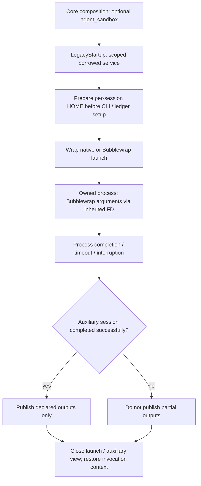

# Optional coordinator-side Agent sandbox

The default optimization composition provides an optional `agent_sandbox` service.
It isolates the coding Agent on the coordinator; it does not change the GPU executor.
Native execution remains the default (`none`) on macOS and Linux. Explicit `bwrap`
requires Linux, Bubblewrap and permitted unprivileged user namespaces, and fails
instead of silently falling back to native execution.

This module migrates the Agent launch boundary only. It does not introduce AKA Light's
Supervisor HTTP Runtime, measurement store, Journal, Git ownership or simplified
episode workflow.

## Enable and configure

From a checkout:

```sh
python orchestrator/optimize.py \
  --op-dir /path/to/problem --platform L20N --framework Triton \
  --agent-cli claude --workspace /path/to/runs --agent-sandbox bwrap
```

The installed entrypoint accepts the same optimization arguments after `--`:

```sh
aka optimize --repo-root /path/to/aka -- \
  --op-dir /path/to/problem --platform L20N --framework Triton \
  --workspace /path/to/runs --agent-sandbox bwrap
```

`--bwrap-executable` selects the executable. Repeat `--agent-read-only-path PATH` to
grant additional existing read-only files or directories. Grants must be narrow:
the workspace, session-home tree, operator Home and sensitive provider directories
cannot be broadly re-exposed. Provider installation mounts are derived separately
from the executable and its bounded dependency graph.

Configuration precedence is explicit CLI arguments, then the recorded operator
environment, then plugin defaults. The launch profile captures values **and absence**
of `ATREX_AGENT_SANDBOX`, `ATREX_BWRAP_EXECUTABLE` and
`ATREX_AGENT_READ_ONLY_PATHS` for children and recovery. The latter environment value
is a JSON array of paths, not a shell-delimited list.

The default bundle's `agent-sandbox` row can also be configured through a Core patch:

```json
{
  "api_version": 1,
  "patches": [{
    "id": "agent-sandbox",
    "config": {
      "repo_root": "${aka:repo_root}",
      "mode": "bwrap",
      "executable": "bwrap",
      "read_only_paths": []
    }
  }]
}
```

Pass the file with `aka optimize --repo-root /path/to/aka --patch FILE -- ...`.
Core patches replace the whole config. To omit the module entirely, use a patch row
`{"id": "agent-sandbox", "remove": true}`. Native launches still work without the
service; requesting isolation without it is an error.

## Module and launch lifecycle

`aka.contracts.agent_sandbox.AgentSandbox` defines the application-facing contract.
`aka.legacy.agent_sandbox.plugin` supplies its implementation and declares the
`agent_sandbox` service token. `LegacyStartup` borrows that service for one invocation.
Core itself imports no Bubblewrap or optimizer code.

The service prepares the environment before CLI construction and Codex usage-ledger
observation, wraps the launch, and resets `scratch/` only when a new Episode is
materialized. Retries and handoff continuations do not reset it. A scoped launch
context forwards the selected service through legacy process calls; auxiliary worker
threads explicitly inherit that context. Leaving the invocation restores the previous
context, so one in-process campaign cannot leak its policy into another.



The existing process owner still controls timeout, interruption and durable handoff.
Argument FDs survive that wrapper but are closed after spawning. Auxiliary cleanup
failures are diagnostic; they do not replace a successful process result or mask an
already-propagating exception.

## Boundary and compatibility

In `bwrap` mode:

- The namespace starts with an empty root and explicit system/runtime mounts. The
  Agent workspace and its session-specific Home are writable; repository assets and
  explicit additional resources are read-only.
- Home lives beside the workspace under `.atrex-agent-homes/`. Only allowlisted
  provider authentication/settings are copied, with bounded no-follow reads. Operator
  transcripts and unrelated Home contents are not copied. A resumed session reuses
  its own Home; different session identities use separate Homes.
- CLI installation discovery mounts narrowly scoped executable/package dependencies,
  not the first-level operator Home directory containing them. Environment values
  travel through Bubblewrap's `--args FD`, not its observable command-line arguments.
- Auxiliary production, numerical, baseline, problem-generation and plan-probe
  sessions receive role-specific input views, stripped GPU/Wiki authority environment
  values, and only declared outputs are copied back after exit code zero. Snapshot
  input is capped at 4096 files / 16 MiB; each published output at 8 MiB.
- `--die-with-parent` is enabled only for durable handoff launches, whose parent is
  the ownership wrapper. Direct launches retain the native lifetime semantics: a
  coordinator crash can leave an Agent alive until the existing recovery cleanup acts.

The optimizer retains the **existing upstream authority model**: legacy Git metadata,
Gateway configuration and evaluator paths required by its current workflow remain
available through scoped compatibility mounts. This is not a claim that the Agent
cannot access evaluator inputs or forge same-UID controller state. Moving those
authorities into a private Supervisor is a separate change.

Network access remains available for model providers. Provider credentials needed by
the CLI are intentionally available to that session. SSH keys, agent sockets and
operator SSH configuration are not automatically copied: coordinator-side `bwrap`
combined with an SSH GPU executor requires explicitly provisioned session-local SSH
authentication, or native mode. External plugin resources outside the normal assets
need narrow explicit grants when required.

## Verification

External regression checks cover composition with and without the optional service,
selection reconstruction, context propagation, native defaults, bounded no-follow
reads, mount rejection, argument-FD inheritance, real Bubblewrap filesystem isolation,
legacy Git Worktree access, auxiliary success/failure/timeout publication, scratch
lifecycle and Codex Home selection. No test modules are added to the repository.

The upstream tool-plugin catalog is also exercised inside the actual Bubblewrap
namespace, using the normal `tools/plugin.py list` entrypoint and registry lock.

- Lima Ubuntu, Python 3.14.4, Bubblewrap 0.11.1: **37 checks passed**, including actual
  durable-handoff launches and argument-FD inheritance through the ownership wrapper.
- macOS, Python 3.14.6: **23 passed, 14 Linux-only checks skipped**; explicit Bubblewrap
  selection fails with an actionable platform error.
- Actual isolated CLI startup: Claude 2.1.235, Codex 0.148.0 and Qoder 1.1.28 each
  returned `--version` successfully. These checks did not invoke a model or GPU.
- Existing Long Horizon checks: 4 passed. Existing GPU Wiki checks: 128 run, 8 skipped.

A minimal Linux launch smoke check, from the repository root:

```sh
PYTHONPATH=src python - <<'PY'
import sys
import tempfile
from pathlib import Path
from orchestrator.agent_launch import use_agent_sandbox
from orchestrator.agent_runtime.process import run_bounded
from aka.legacy.agent_sandbox.policy import SandboxPolicy

policy = SandboxPolicy(Path.cwd()).configure(mode="bwrap")
with tempfile.TemporaryDirectory() as directory, use_agent_sandbox(policy):
    workspace = Path(directory) / "workspace"
    workspace.mkdir()
    stdout, stderr, code, timed_out = run_bounded(
        [sys.executable, "-c", "print('isolated startup OK')"], workspace, 30, {}
    )
    print(stdout, stderr, code, timed_out)
    assert code == 0 and not timed_out
PY
```

No live model/GPU campaign has been performed for this migration. The checks validate
launch and filesystem behavior, not model quality or end-to-end optimization results.

## Disable and rollback

Start a new invocation with `--agent-sandbox none`, or remove the optional composition
row. There is no automatic platform fallback and no live policy replacement for an
already-running process. Native mode does not create session Homes or alter legacy
Home handling. Preserve the campaign's recorded launch selection during recovery;
do not hand-edit its digest to bypass implementation identity checks after changing
code or composition.
